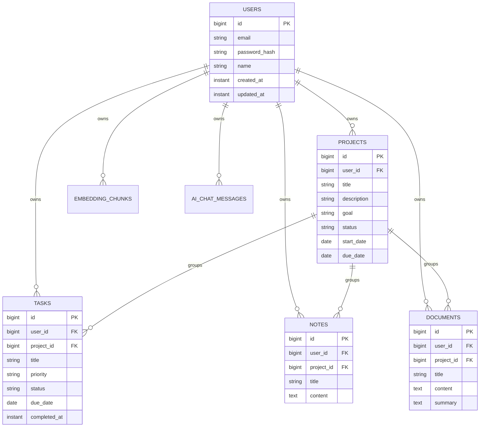

# AIOS-Core ERD

```mermaid
erDiagram
  USERS ||--o{ PROJECTS : owns
  USERS ||--o{ TASKS : owns
  USERS ||--o{ NOTES : owns
  USERS ||--o{ DOCUMENTS : owns
  USERS ||--o{ EMBEDDING_CHUNKS : owns
  USERS ||--o{ AI_CHAT_MESSAGES : owns
  PROJECTS ||--o{ TASKS : groups
  PROJECTS ||--o{ NOTES : groups
  PROJECTS ||--o{ DOCUMENTS : groups

  USERS {
    bigint id PK
    string email
    string password_hash
    string name
    instant created_at
    instant updated_at
  }

  PROJECTS {
    bigint id PK
    bigint user_id FK
    string title
    string description
    string goal
    string status
    date start_date
    date due_date
  }

  TASKS {
    bigint id PK
    bigint user_id FK
    bigint project_id FK
    string title
    string priority
    string status
    date due_date
    instant completed_at
  }

  NOTES {
    bigint id PK
    bigint user_id FK
    bigint project_id FK
    string title
    text content
  }

  DOCUMENTS {
    bigint id PK
    bigint user_id FK
    bigint project_id FK
    string title
    text content
    text summary
  }
```
